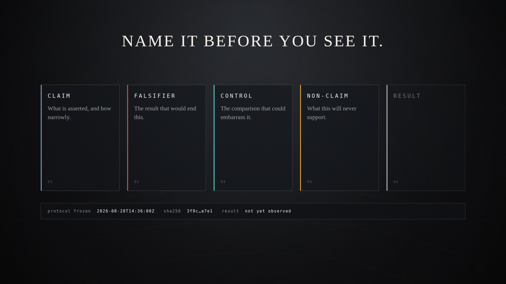
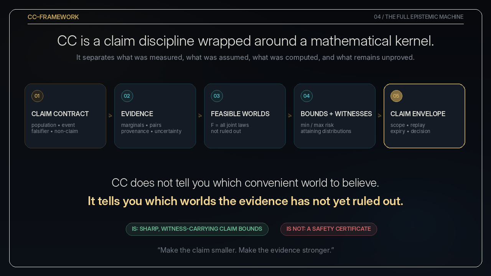

# CC-Framework

**Dependence-aware partial identification of failure risk in composed AI
guardrails. Sharp bounds and endpoint witnesses — not a safety certification.**

[](https://github.com/Cubits11/cc-framework/actions/workflows/ci.yml)
[](https://www.python.org/downloads/)
[](LICENSE)
<!-- DOI badge placeholder: uncomment after Zenodo mints a DOI in Phase 2e. -->
<!-- [](https://doi.org/10.5281/zenodo.TODO) -->

---

<p align="center">
  <a href="visual_identity/before_you_see_it/README.md">
    
  </a>
</p>

<p align="center">
  <b>A story can start a question. It cannot finish an answer.</b><br>
  <sub><a href="visual_identity/before_you_see_it/README.md"><b>Before You See It</b></a>
  &nbsp;·&nbsp; a 15-second film &nbsp;·&nbsp; <i>Keep the wonder. Check the claim.</i></sub>
</p>

Those five cards are the entire discipline. Name the **claim**. Name the
**falsifier** that would end it. Name the **control** that could embarrass it.
Name the **non-claim** it will never support. Then lock all four *before* the
result slot is filled, and let the result disagree.

This repository is the machinery for doing that to composed AI guardrail
evidence: Frechet-Hoeffding bounds that stay honest about unknown dependence,
evidence roles that decide what a measurement is allowed to say, receipts that
prove bytes and refuse to prove safety, and claims that expire. The film has one
`INCONCLUSIVE` frame in it on purpose - and when it has no verifier output to
show, it stamps `ILLUSTRATION` on its own footage rather than imply a result it
was not given.

---

## What is CC-Framework?

**CC-Framework is a Python research framework for dependence-aware partial
identification of failure risk in composed AI guardrails.**

It does not ask:

> "What single safety number looks plausible?"

It asks:

> **"Across every joint failure world still compatible with the evidence, what
> is the smallest and largest system-level failure probability?"**

It then exposes concrete **endpoint witnesses** — joint distributions that
actually attain those limits — so the reported range is inspectable rather than
rhetorical. It is explicitly **not** a deployment-safety certificate.

## The correct meaning of "CC"

"CC" is **not** a correlation coefficient, and CC-Framework is **not** the name
of one magical scalar. Earlier Composition Coefficient ratios (`cc_gain`,
`cc_shift`, and the deprecated `cc_max` / `cc_rel` family) remain legacy or
secondary metric surfaces. The current front-door theory is:

> **Dependence-aware composition of guardrail evidence through partial
> identification, sharp bounds, and endpoint witnesses.**

**CC-Framework is the project name — not the name of a number.**

## The canonical example

Suppose two guardrails each fail 10% of the time:

```text
P(A) = P(B) = 0.10
```

Multiplying them gives `0.10 × 0.10 = 0.01`. But that multiplication silently
selected the **independent coupling**. Independence was never contained in the
two marginal scores; it was assumed on their behalf.

Without dependence evidence, the Fréchet bounds are all that is licensed:

```text
max(0, P(A) + P(B) - 1)  ≤  P(A ∩ B)  ≤  min(P(A), P(B))

                     0%  ≤  P(A ∩ B)  ≤  10%
```

The 1% answer is one point inside a range ten times its own width. The **lower
witness** places the two failure sets apart; the **upper witness** makes their
blind spots coincide perfectly. Both are consistent with the same two scores.

<p align="center">
  
</p>

Reproduce both witnesses:

```bash
PYTHONPATH=src python -c "
from cc.kernel.strict import AssumptionSet, LinearQuery
labels = ('A_failure', 'B_failure')
a = AssumptionSet.empty(labels)
for label in labels:
    a = a.with_marginal_interval(label, 0.10, 0.10)
r = a.identify(LinearQuery.intersection(labels, labels, name='P(both fail)'))
print(f'identified interval: [{r.lower_bound:.2f}, {r.upper_bound:.2f}]')
print('independence would say:', 0.10 * 0.10)
print('lower witness:', r.lower_solution)
print('upper witness:', r.upper_solution)
"
```

```text
identified interval: [0.00, 0.10]
independence would say: 0.010000000000000002
lower witness: [0.8 0.1 0.1 0. ]
upper witness: [ 0.9 -0.   0.   0.1]
```

## The complete epistemic machine

<p align="center">
  
</p>

<p align="center"><sub><a href="docs/assets/epistemic-machine.gif">Animated</a> &middot; <a href="docs/assets/epistemic-machine.mp4">MP4</a><br>The figure groups the two middle stages differently from the table below: it shows <em>Feasible Worlds</em> for the identification kernel, and merges bounds with their witnesses into one panel. Six rows, five panels, same machine.</sub></p>

| Layer | What it contributes |
| --- | --- |
| **Claim contract** | Population, target event, falsifier, assumptions, and non-claims |
| **Evidence** | Marginals, pairwise observations, uncertainty, and provenance |
| **Identification kernel** | The complete class of joint worlds not ruled out |
| **Sharp bounds** | Minimum and maximum supported event risk |
| **Witnesses** | Concrete distributions attaining both endpoints |
| **Claim envelope** | Scope, replay path, limitations, expiry, and decision status |

Receipts and hashes establish artifact identity and replayability. The
repository explicitly refuses to treat integrity as proof of measurement
validity, representativeness, or safety. Its conclusions remain conditional on
the supplied binary events, evidence, and assumptions.

## Public Boundary

| Surface | Role | Claim boundary |
| --- | --- | --- |
| Paper Core | Manuscript, deterministic paper artifacts, theorem ledger, and validation matrix. | Supports the v0.3 finite-atom partial-identification claim only. |
| Research Kernel | `cc.kernel.strict`, atom LPs, Frechet helpers, canonical metrics, endpoint witnesses, and finite-sample helpers. | Bounds composed binary failure probability under declared assumptions. |
| Evidence Governance | Claim envelopes, evidence roles, Merkle logs, receipts, confirmatory protocol, and decay semantics. | Supports replayable evidence records; hashes and signatures do not prove validity or safety. |
| Ecosystem Bridges | Optional adapters for external guardrail or evaluation tools. | Interop only; not paper-core evidence unless promoted by a release note. |
| Enterprise Reference | AWS/KMS/S3/DynamoDB/API reference and moto-backed smoke tests. | Experimental evidence-integrity reference; not an enterprise product or compliance claim. |
| Dashboard/Demo | Next.js dashboard and Claim Observatory visual material. | Demonstrates reports and evidence bundles; it does not define the research kernel. |
| Experimental/Archive | Experiments, notebooks, historical generated results, and preserved side branches. | Useful research material outside the release claim path unless explicitly promoted. |

## Business & Assurance Interpretation

CC-Framework can also be read as a prototype for **AI safety disclosure
controls**. In high-stakes organizational settings, a major failure mode is not
only technical miscalculation, but institutional overclaiming: presenting
narrow, procedural, stale, or brittle evaluation evidence as broad proof of
deployment safety.

The framework applies a disclosure-control lens to AI assurance reports. It
keeps statistical assumptions, evidence artifacts, cryptographic receipts,
human review, validation lanes, and deployment claims conceptually separate.
This is analogous to internal-control thinking in financial reporting: the
goal is to make public claims traceable to assumptions, evidence, validation
procedures, and explicit limitations.

This interpretation does not expand the project's claim boundary. CC-Framework
remains a research prototype. It does not certify deployed systems, prove
compliance, validate dataset representativeness, or turn receipt integrity into
empirical truth. Its narrower purpose is to make AI assurance claims more
evidence-bound, reproducible, and harder to overstate accidentally.

## Claim Boundary Manifest

CC-Framework now maintains a claim-boundary manifest that maps public claims to
validation lanes, supporting files, tests or commands, and explicit non-claims.
The manifest is intended to prevent documentation, demos, receipts, dashboards,
or enterprise references from being interpreted as broader assurance claims
than the repository supports. See
[docs/claims/CLAIM_BOUNDARY_MANIFEST.md](docs/claims/CLAIM_BOUNDARY_MANIFEST.md).

## Open Core Strategy

CC-Framework is currently a public research prototype. Its core mathematical,
reporting, and evidence-boundary primitives are intended to remain inspectable
for credibility and reproducibility. Potential hosted, enterprise, or
customer-specific workflows should remain separate from the research claim
boundary. See `docs/product/OPEN_CORE_STRATEGY.md`.

## 60-second quickstart

```bash
python3 -m venv .venv
source .venv/bin/activate
python -m pip install --upgrade pip wheel setuptools
python -m pip install -e ".[dev]"
python - <<'PY'
from cc.kernel.strict import frechet_bounds

failure_rates = {
    "input_filter": 0.10,
    "policy_judge": 0.10,
}
bounds = frechet_bounds(list(failure_rates.values()), event="and")
independent = failure_rates["input_filter"] * failure_rates["policy_judge"]

print(f"Stacked failure is bounded by [{bounds.lower:.2%}, {bounds.upper:.2%}]")
print(f"Independence would estimate {independent:.2%}")
PY
```

Expected output:

```text
Stacked failure is bounded by [0.00%, 10.00%]
Independence would estimate 1.00%
```

Run focused release-core smoke tests from the activated environment:

```bash
PYTHONPATH=src python -m pytest -q tests/unit/kernel tests/unit/evidence
```

For deeper context, start with the
[public API contract](docs/api.md),
[validation matrix](docs/validation_matrix.md), the
[finite-sample identification note](docs/theory/finite_sample_identification.md),
and the runnable [minimal example](examples/minimal/run_bounds.py).

If you use this software, cite it with the metadata in
[CITATION.cff](CITATION.cff). Contributions should follow
[CONTRIBUTING.md](CONTRIBUTING.md). GitHub Discussions can be enabled from the
repository settings before launch.

## Research Status

This repository is an active research prototype. Its first-paper core is a
finite binary atom kernel for sharp Frechet composition intervals, metric
diagnostics, and endpoint witness distributions. It is not a deployment safety
certificate, not a product platform, and not an AI alignment solution.

### The evidence ladder

Empirical claims are staged. **Passing an earlier rung confers no authority at
a later one**, and claims do not inherit upward by default — every enlargement
of scope must be separately earned.

| Rung | Meaning | Status |
| --- | --- | --- |
| **E0** | Mathematical proposition | Established |
| **E1** | Controlled synthetic realization | **Complete — decision: Narrow** |
| **E2** | Shared-item empirical guardrail pilot | **Contract frozen, UNTESTED** |
| **E3** | Multi-system / multi-dataset replication | Not started |
| **E4** | Prospective external evaluation | Not started |
| **E5** | Operational decision consequence | Not started |

[E1](docs/research/E1_DEPENDENCE_EVIDENCE_STUDY.md) established constructively
that identical singleton **and** pairwise moments can coexist with different
three-way failure probabilities — so "we measured every pair, so we know the
stack" is false in general. It also showed that a product baseline is neither
reliably conservative nor reliably optimistic: it understated a common-cause
generator fourfold and invented risk under a mutually exclusive one. E1 is
synthetic; its
[decision record](docs/research/E1_DECISION_RECORD.md) carries the Narrow
verdict, the standing objections, and the corrections made to its own first
draft.

[E2](docs/research/E2_MEASUREMENT_CONTRACT.md) is frozen **before** any dataset
was inspected, and no conforming dataset has been collected. The phrase "we
validated CC" is prohibited at every rung: it names no population, no event,
and no evidence regime.

The validation tracks are intentionally separated:

- **Paper Core v0.3** is release-candidate quality in v0.3-rc1 for the
  finite-atom kernel, canonical metrics, endpoint witnesses, deterministic
  paper artifacts, and documentation spine.
- **Enterprise Reference v0.1** is an experimental reference architecture for
  preserving evidence integrity around bundles. It is not the paper core and
  does not certify deployment safety.

See [docs/validation_matrix.md](docs/validation_matrix.md) for the command
matrix that states which evidence supports each scoped claim.

For the v0.3-rc1 release narrative and checklist, see
[docs/release/V0_3_RC1_CHECKLIST.md](docs/release/V0_3_RC1_CHECKLIST.md).

## Core Thesis

Composed AI safety should be evaluated as a dependence-aware
partial-identification problem, not as a product of independent guardrail
scores.

The central claim is narrow: many composition claims are underidentified unless
dependence among guardrail failures is measured, bounded, or explicitly
assumed. The kernel computes what follows from declared assumptions and
evidence; it does not validate the upstream data collection process.

## What This Is / What This Is Not

What this is:

- A Python research kernel for finite-atom guardrail failure composition.
- A partial-identification framework for unknown dependence.
- A metrics layer for identified-set and product-baseline diagnostics.
- A witness-oriented reproducibility scaffold for mathematical verification.
- A research program with explicit non-claims and future-work boundaries.

What this is not:

- Not a deployment approval system for deployed models.
- Not proof of deployment safety.
- Not causal inference without causal assumptions.
- Not evidence of dataset representativeness or future performance.
- Not a replacement for red teaming or human governance.
- Not an enterprise, dashboard, AWS, or adapter-centered project.

## Mathematical Object

Let

```text
Z = (Z_1, ..., Z_m),  Z_i in {0, 1}
```

with the repository-wide convention:

```text
Z_i = 1 means guardrail failure / unsafe pass.
```

The unknown object is the joint law

```text
pi(z) = P(Z = z),  z in {0, 1}^m.
```

Evaluation evidence may include singleton failure marginals

```text
p_i = P(Z_i = 1)
```

and optional pairwise constraints

```text
q_ij = P(Z_i = 1, Z_j = 1).
```

Observed evidence — marginal failure rates, pairwise overlaps, or any other
declared linear constraints — defines a feasible class:

```text
F(E) = { pi in simplex(2^m) : pi satisfies the supplied evidence and assumptions }
```

For a declared Boolean composition event `phi(Z)`, the kernel computes:

```text
L_phi = inf_{pi in F(E)} E_pi[phi(Z)]
U_phi = sup_{pi in F(E)} E_pi[phi(Z)]
```

`[L_phi, U_phi]` is the **sharp identified interval**: every excluded value is
incompatible with the declared evidence, and both endpoints are attained by
explicit feasible worlds. Widening the evidence set `E` can only narrow the
interval; it can never widen it. If it does, that is a falsifier.

These are sharp bounds conditional on supplied assumptions and evidence — never
on the quality of the measurement that produced them.

## Implemented Kernel Surface

The current publication-facing kernel surface is intentionally small:

- [src/cc/kernel/sensitivity.py](src/cc/kernel/sensitivity.py): finite binary
  atom LP, linear assumptions, sharp identified intervals, infeasibility
  detection, endpoint witness distributions.
- [src/cc/kernel/metrics.py](src/cc/kernel/metrics.py): formal estimand-layer
  diagnostics such as `fh_width`, `fh_position`,
  `independent_event_probability`, `independence_regret`, `cc_gain`, and
  `cc_shift`.
- [src/cc/kernel/frechet_classes.py](src/cc/kernel/frechet_classes.py):
  classical Frechet special cases and side-constrained finite Bernoulli bounds.
- [src/cc/kernel/sample_complexity.py](src/cc/kernel/sample_complexity.py):
  Hoeffding-style sample-size and radius helpers for singleton and pairwise
  Bernoulli failure-rate estimates, with explicit metadata for count-derived
  interval constraints and modeling assumptions.
- [src/cc/evals/dependence_benchmark.py](src/cc/evals/dependence_benchmark.py):
  benchmark ingestion and Paper 1 example summaries using the repository
  convention that `Z_i=1` means unsafe pass / guardrail failure.
- [docs/theory/metric_taxonomy.md](docs/theory/metric_taxonomy.md): canonical
  metric domains and deprecated-name mapping.
- [docs/theory/theorem_ledger.md](docs/theory/theorem_ledger.md): mathematical
  claims, implementation witnesses, tests, and non-claims.
- [docs/theory/finite_sample_identification.md](docs/theory/finite_sample_identification.md):
  finite-sample outer-confidence theorem and sampling assumptions.

Other modules remain useful but should be described more carefully:

- `src/cc/core`, `src/cc/exp`, and `src/cc/cartographer` are protocol,
  workflow, or legacy surfaces.
- `experiments/`, `scripts/`, and `notebooks/` are experimental surfaces.
- `apps/dashboard`, vendor adapters, and enterprise references are application
  or demonstration surfaces, not the first-paper core.

## Minimal Example

This example uses the current kernel API to identify the probability that at
least one declared guardrail failure occurs, given exact singleton failure
marginals and no dependence assumption.

```python
from cc.kernel.strict import (
    AssumptionSet,
    LinearQuery,
    fh_width,
    independence_regret,
    independent_event_probability,
)

labels = ("input_filter_failure", "policy_judge_failure")
marginals = {
    "input_filter_failure": 0.08,
    "policy_judge_failure": 0.05,
}

assumptions = AssumptionSet.empty(labels)
for label, value in marginals.items():
    assumptions = assumptions.with_marginal_interval(label, value, value)

query = LinearQuery.union(
    labels,
    labels,
    name="P(any guardrail failure)",
)

result = assumptions.identify(query)
width = fh_width(result.lower_bound, result.upper_bound)
product_baseline = independent_event_probability(marginals, query, labels=labels)
endpoint_regrets = (
    independence_regret(result.lower_bound, product_baseline),
    independence_regret(result.upper_bound, product_baseline),
)

print(result.lower_bound, result.upper_bound)
print(width, product_baseline, endpoint_regrets)
```

For a runnable reviewer-facing script with witness checks, see
[examples/minimal/run_bounds.py](examples/minimal/run_bounds.py).

## Metrics

The canonical metric taxonomy has four categories:

| Category | Metrics | Interpretation |
| --- | --- | --- |
| Identified-set diagnostics | `fh_width`, `fh_position` | Describe the sharp interval `[L_phi, U_phi]` and where a selected event risk lies inside it. |
| Assumption-comparison diagnostics | `independent_event_probability`, `independence_regret` | Compare a declared event risk with an explicit product-coupling baseline. |
| One-world normalization diagnostics | `cc_gain` | Normalize a composition failure risk by the largest singleton failure risk in the same setting. |
| Two-world movement diagnostics | `cc_shift` | Summarize movement in composition failure risk relative to singleton failure-rate movement across two settings. |

Older names such as `cc_max`, `cc_rel`, `delta_add`, and `delta_mult` are
legacy/deprecated compatibility surfaces. They should not be presented as the
front-door theory; see [docs/theory/metric_taxonomy.md](docs/theory/metric_taxonomy.md).

## Witnesses and Reproducibility

If the LP reports `[L_phi, U_phi]`, a reproducible result should expose endpoint
witness distributions `pi_L` and `pi_U` that satisfy the declared constraints
and achieve the lower and upper endpoints.

Witnesses verify mathematical feasibility relative to supplied constraints.
They do not verify dataset representativeness, causal validity, semantic
coverage, or deployment safety.

The repository already exposes endpoint solutions through
`IdentificationResult.lower_solution` and `IdentificationResult.upper_solution`.
Paper-core artifacts can be regenerated with `make reproduce-paper` and checked
with `make verify-paper-artifacts`. This pipeline verifies deterministic kernel
artifacts and endpoint witnesses; it is not a claim that empirical benchmark
inputs are representative or deployment-valid.

The current Paper 1 LaTeX source is `paper/main.tex`. Run `make paper-smoke`
for static source checks and an optional LaTeX build when `latexmk` is
available.

## Research Program Documents

- [Research Program](docs/research/RESEARCH_PROGRAM.md)
- [E1 — Dependence-Evidence Study (frozen wager)](docs/research/E1_DEPENDENCE_EVIDENCE_STUDY.md)
- [E1 — Epistemic Decision Record (verdict: Narrow)](docs/research/E1_DECISION_RECORD.md)
- [E2 — Shared-Item Measurement Contract (frozen, untested)](docs/research/E2_MEASUREMENT_CONTRACT.md)
- [Paper Core](docs/research/PAPER_CORE.md)
- [Public API Contract](docs/api.md)
- [Evidence-Bound Claim Governance Memo](docs/research/CLAIM_GOVERNANCE_OS.md)
- [Non-Claims](docs/research/NON_CLAIMS.md)
- [Roadmap](docs/research/ROADMAP.md)
- [Metric Taxonomy](docs/theory/metric_taxonomy.md)
- [Theorem Ledger](docs/theory/theorem_ledger.md)
- [Reproducibility Notes](docs/reproducibility.md)
- [v0.3-rc1 Checklist](docs/release/V0_3_RC1_CHECKLIST.md)

## Repository Structure

```text
src/cc/kernel/              canonical finite-atom and metric kernel
src/cc/core/                protocol and legacy workflow support
src/cc/exp/                 two-setting experiment runners
src/cc/cartographer/        workflow, reporting, and older atlas utilities
examples/minimal/           smallest runnable atom-LP example
docs/theory/                metric taxonomy, theorem ledger, derivations
docs/research/              research spine, paper core, non-claims, roadmap
experiments/                experimental studies and demonstrations
apps/dashboard/             application surface, not first-paper core
```

## Installation and Validation

Create a local environment and install development dependencies:

```bash
python3 -m venv .venv
.venv/bin/pip install --upgrade pip wheel setuptools
.venv/bin/pip install -e '.[dev,docs]'
```

Runtime support:

- Local package floor: Python 3.10 or newer.
- CI code/docs matrix: Python 3.10, 3.11, 3.12, and 3.13.

Run the minimal example:

```bash
PYTHONPATH=src .venv/bin/python examples/minimal/run_bounds.py
```

Kernel validation commands:

```bash
PYTHONPATH=src .venv/bin/pytest tests/unit/kernel -q
PYTHONPATH=src .venv/bin/mypy src/cc/kernel --strict
.venv/bin/ruff check src/cc/kernel tests/unit/kernel
.venv/bin/mkdocs build --strict
make paper-smoke
```

Release-facing validation lanes are documented in
[docs/validation_matrix.md](docs/validation_matrix.md) and summarized in the
[v0.3-rc1 checklist](docs/release/V0_3_RC1_CHECKLIST.md). The short version:
`make test-kernel`, `make test-release`, `make docs`, and
`PYTHONPATH=src .venv/bin/pytest -q` support the v0.3-rc1 evidence record;
`make reproduce-paper` and `make verify-paper-artifacts` support deterministic
paper artifacts. Enterprise, dashboard, security, and vendor checks are
separate lanes with their own optional dependencies and non-claims.

Paper 1 benchmark summaries can be generated with:

```bash
PYTHONPATH=src .venv/bin/python -m cc.evals.dependence_benchmark \
  --dataset tests/fixtures/dependence_benchmark_harmful.csv \
  --adapters keyword_blocker \
  --keyword-terms jailbreak,exploit \
  --out /tmp/cc-dependence-summary.json
```

## Experimental Surfaces

Experimental and historical material remains in the repository, but it is not
the README's central theory.

- Two-setting diagnostics and older Composition Coefficient ratios are protocol
  or legacy material. Use `cc_shift` for the canonical two-setting movement
  diagnostic.
- Correlation-cliff experiments are research demonstrations; see
  [experiments/correlation_cliff/README.md](experiments/correlation_cliff/README.md)
  and [docs/theory/correlation_cliffs.md](docs/theory/correlation_cliffs.md).
- Older audit packets, manifests, adapters, dashboards, and cloud references
  are supporting or application surfaces unless a specific document promotes
  them into a reviewed contract.

## Limitations and Non-Claims

The kernel operates on finite binary failure events and explicit linear
constraints. Its conclusions are conditional on those inputs.

Key limitations:

- Binary event reductions may hide score-level or semantic structure.
- Estimated marginals and pairwise constraints require their own statistical
  justification.
- Pairwise evidence generally does not identify the full joint law.
- Explicit atom enumeration has scaling limits as `m` grows.
- Static finite-atom bounds are not a sequential agent framework.

Non-claims:

- The project does not prove deployment safety.
- The project does not certify deployed models.
- The project does not infer causality without causal assumptions.
- The project does not establish dataset representativeness or future behavior.
- The project does not make cryptographic integrity equivalent to statistical
  validity.

See [docs/research/NON_CLAIMS.md](docs/research/NON_CLAIMS.md) for the stricter
claim boundary.

## Citation

No archival citation exists yet. Until a preprint or release artifact exists,
cite the repository URL and commit hash used for the analysis.

## License

MIT. See [LICENSE](LICENSE).
