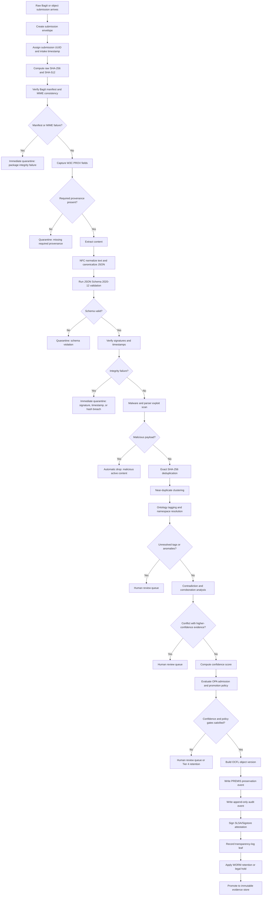

# Evidence Governance Repository Phase 1

This document specifies the Phase 1 constitutional layer for an evidence
governance repository integrated with `cc-framework`. It is an evidence and
assurance compilation substrate, not a deployment approval system, not proof of
deployment safety, and not causal inference without assumptions.

## Repository Directory Structure

```text
cc-framework/
├── docs/
│   ├── architecture/
│   │   ├── evidence-governance-phase-1.md
│   │   ├── AUDIT_EVIDENCE_BOUNDARIES.md
│   │   └── STRICT_KERNEL_CONTRACT.md
│   ├── design-specs/
│   ├── governance/
│   ├── research/
│   └── runbooks/
├── schemas/
│   ├── cc_report.schema.json
│   ├── common/
│   │   ├── digest.schema.json
│   │   ├── actor.schema.json
│   │   ├── timestamp.schema.json
│   │   ├── signature.schema.json
│   │   └── confidence.schema.json
│   ├── evidence/
│   │   ├── evidence-item.schema.json
│   │   ├── custody-event.schema.json
│   │   ├── review-decision.schema.json
│   │   ├── extraction-report.schema.json
│   │   └── contradiction-link.schema.json
│   ├── ontology/
│   │   ├── namespace-manifest.schema.json
│   │   ├── ontology-node.schema.json
│   │   ├── ontology-edge.schema.json
│   │   ├── concept-scheme.schema.json
│   │   └── mapping-rule.schema.json
│   ├── storage/
│   │   ├── bag-manifest.schema.json
│   │   ├── ocfl-object-extension.schema.json
│   │   ├── retention-policy.schema.json
│   │   ├── embedding-record.schema.json
│   │   └── cold-tier-restore.schema.json
│   └── audit/
│       ├── access-event.schema.json
│       ├── pipeline-event.schema.json
│       ├── transparency-entry.schema.json
│       └── signing-event.schema.json
├── ontology/
│   ├── contexts/
│   │   ├── evidence.context.jsonld
│   │   ├── provenance.context.jsonld
│   │   └── review.context.jsonld
│   ├── namespaces/
│   │   ├── registry.yaml
│   │   ├── reserved-prefixes.yaml
│   │   └── deprecation-map.yaml
│   ├── schemes/
│   │   ├── domains/
│   │   ├── document-types.ttl
│   │   ├── evidence-tiers.ttl
│   │   └── extraction-methods.ttl
│   ├── owl/
│   │   ├── evidence-core.owl.ttl
│   │   ├── provenance-axioms.owl.ttl
│   │   └── governance-axioms.owl.ttl
│   ├── mappings/
│   │   ├── prov-mapping.yaml
│   │   ├── premis-mapping.yaml
│   │   ├── dcat-mapping.yaml
│   │   └── external-taxonomy-crosswalks/
│   └── catalog/
│       ├── catalog.ttl
│       └── datasets/
├── pipelines/
│   ├── ingest/
│   │   ├── package_submission.py
│   │   ├── verify_manifest.py
│   │   ├── capture_provenance.py
│   │   └── submit_to_queue.py
│   ├── sanitation/
│   │   ├── mime_validate.py
│   │   ├── schema_validate.py
│   │   ├── canonicalize_json.py
│   │   ├── normalize_text.py
│   │   ├── detect_malware.py
│   │   ├── compute_hashes.py
│   │   └── score_extraction_quality.py
│   ├── dedupe/
│   │   ├── exact_hash_match.py
│   │   ├── near_duplicate_text.py
│   │   ├── near_duplicate_media.py
│   │   └── contradiction_probe.py
│   ├── review/
│   │   ├── route_quarantine.py
│   │   ├── assign_reviewers.py
│   │   ├── merge_decisions.py
│   │   └── emit_review_attestation.py
│   ├── promote/
│   │   ├── build_ocfl_object.py
│   │   ├── write_premis_event.py
│   │   ├── lock_worm_retention.py
│   │   └── publish_catalog_record.py
│   ├── observability/
│   │   ├── emit_pipeline_event.py
│   │   ├── export_otel_logs.py
│   │   └── anomaly_alerts.py
│   ├── lib/
│   │   ├── hashing.py
│   │   ├── signatures.py
│   │   ├── policy_client.py
│   │   ├── ontology_client.py
│   │   └── time_stamping.py
│   └── tests/
├── policies/
│   ├── governance/
│   │   ├── evidence-lifecycle.md
│   │   ├── confidence-scoring.md
│   │   ├── reviewer-consensus.md
│   │   └── deprecation-policy.md
│   ├── access/
│   │   ├── roles.yaml
│   │   ├── attributes.yaml
│   │   ├── data-classification.yaml
│   │   └── separation-of-duties.yaml
│   ├── retention/
│   │   ├── worm-retention.yaml
│   │   ├── legal-hold.yaml
│   │   ├── cold-archive.yaml
│   │   └── restore-sla.yaml
│   ├── rego/
│   │   ├── admission/
│   │   ├── promotion/
│   │   │   ├── tiering.rego
│   │   │   ├── conflict.rego
│   │   │   └── retention.rego
│   │   └── access/
│   └── exceptions/
├── storage/
│   ├── manifests/
│   │   ├── storage-classes.yaml
│   │   ├── ocfl-storage-root.yaml
│   │   ├── bucket-layout.yaml
│   │   └── encryption-kms.yaml
│   ├── bagit/
│   │   ├── bag-info-template.txt
│   │   ├── tagmanifest-sha256-template.txt
│   │   └── submission-profile.yaml
│   ├── ocfl/
│   │   ├── extensions/
│   │   ├── validation-profiles/
│   │   └── object-template/
│   │       ├── 0=ocfl_object_1.1
│   │       ├── inventory.json
│   │       └── v1/
│   │           ├── inventory.json
│   │           └── content/
│   ├── tiers/
│   │   ├── quarantine/
│   │   ├── raw/
│   │   ├── normalized/
│   │   ├── derivatives/
│   │   ├── embeddings/
│   │   ├── catalog/
│   │   └── cold/
│   └── restore/
├── audit-logs/
│   ├── schemas/
│   │   ├── decision-ledger.schema.json
│   │   ├── access-log.schema.json
│   │   ├── pipeline-log.schema.json
│   │   └── transparency-log.schema.json
│   ├── pipeline/
│   ├── access/
│   ├── decisions/
│   ├── signing/
│   └── transparency/
└── src/cc/
    ├── kernel/
    │   ├── frechet_classes.py
    │   ├── sensitivity.py
    │   └── frechet_sensitivity.py
    ├── evidence/
    │   ├── claim_governance.py
    │   ├── confirmatory_protocol.py
    │   ├── decay.py
    │   ├── merkle_log.py
    │   └── role_ontology.py
    ├── reporting/
    │   ├── canonical.py
    │   └── report.py
    └── redteam/
        └── dependence_search.py
```

`src/cc/claims/` is intentionally absent from Phase 1. Claim lifecycle states
remain quarantined until a separate claim compiler is designed.

## RACI Matrix

Legend: R = responsible for normal work, A = accountable approver, C =
consulted reviewer, I = informed observer, E = exception authority.

| Area | Ingestion bot | Synthesis engine | Policy sentinel | Submitter | Curator | Reviewer | Policy-admin | Auditor |
| --- | --- | --- | --- | --- | --- | --- | --- | --- |
| `/schemas` | I | C | R | I | C | C | A/E | C |
| `/ontology` | I | C | R | I | A | C | E | C |
| `/pipelines/ingest` | R | I | C | C | A | I | E | C |
| `/pipelines/sanitation` | R | C | R | I | A | C | E | C |
| `/pipelines/dedupe` | R | C | C | I | A | C | E | C |
| `/pipelines/review` | C | C | R | I | A | R | E | C |
| `/pipelines/promote` | R | I | R | I | C | A | E | C |
| `/policies/governance` | I | C | R | I | C | C | A/E | C |
| `/policies/rego` | I | I | R | I | C | C | A/E | C |
| `/storage/bagit` | R | I | C | C | A | I | E | C |
| `/storage/ocfl` | R | I | C | I | A | C | E | C |
| `/storage/tiers/quarantine` | R | I | R | I | A | R | E | C |
| `/audit-logs` | R | I | R | I | I | C | E | A |
| `/src/cc/kernel` | I | C | C | I | C | C | A | C |
| `/src/cc/evidence` | I | C | R | I | C | A | E | C |
| `/src/cc/reporting` | I | R | R | I | C | A | E | C |
| `/src/cc/redteam` | I | R | C | I | C | C | E | I |

Authority constraints:

- Submitters can create submissions and read their own submission status. They
  cannot promote, edit normalized evidence, alter policy, or approve exceptions.
- Curators own metadata completeness, ontology routing, and quarantine
  triage. They cannot override Rego denials without a policy-admin exception.
- Reviewers approve human-review requirements but cannot modify confidence
  scores or statistical weights.
- Policy-admins own policy and exception mechanics. Exception records require
  owner, expiry, affected policy, reason, and attestation.
- Auditors have read access to all evidence, audit logs, policy bundles, and
  storage inventories. They do not mutate evidence records.

## Confidence Model

Let:

- `P` = provenance completeness score in `[0, 1]`
- `I` = integrity score in `[0, 1]`
- `R` = source reliability score in `[0, 1]`
- `C` = corroboration score in `[0, 1]`
- `T` = temporal validity or freshness score in `[0, 1]`
- `E` = extraction quality score in `[0, 1]`

The confidence score is:

```text
confidence(e) = round(0.24P + 0.24I + 0.18R + 0.16C + 0.10T + 0.08E, 3)
```

Promotion thresholds:

| Tier | Rule |
| --- | --- |
| Tier 1 | `P >= 0.95`, `I == 1.0`, and `confidence >= 0.85` |
| Tier 2 | `P >= 0.80`, `I >= 0.90`, and `confidence >= 0.70` |
| Tier 3 | `P >= 0.55`, `I >= 0.70`, and `confidence >= 0.45` |
| Tier 4 | Otherwise; raw, unverified, or retained only for review |

Human review may satisfy a policy gate. It does not change `P`, `I`, `R`,
`C`, `T`, `E`, or `confidence(e)`.

## Ingestion, Sanitation, And Quarantine Workflow



## Failure-State Specification

Automatic drop:

- Malware, parser exploit payload, or active content that violates ingestion
  safety policy.
- Payload type that cannot be safely parsed in a sandbox and has no approved
  manual handling profile.
- Attempted overwrite or deletion of a WORM-protected object.

Immediate quarantine:

- Raw package hash mismatch.
- BagIt manifest mismatch or missing required payload manifest.
- Declared MIME type inconsistent with detected MIME type.
- Missing required provenance fields.
- JSON Schema failure on required fields or forbidden extra fields.
- Required signature absent, revoked, unverifiable, or failed.
- Timestamp from the future outside the accepted clock-skew window.
- Chain-of-custody event hash mismatch.
- Empty `non_claims` array.
- Overclaiming text that asserts deployment approval, absolute safety, model
  truth, or causal inference without assumptions.
- Exploratory red-team evidence routed to confirmatory promotion without a
  pre-registered protocol binding and model version hash increment.

Human-review exception queue:

- Incomplete but plausibly reconstructible provenance.
- OCR or extraction quality below policy threshold.
- Near duplicate with numeric or temporal drift.
- Unresolved ontology mapping or namespace ambiguity.
- Legal, privacy, or data-classification ambiguity.
- Contradiction with higher-confidence evidence.
- Confidence score below requested tier threshold but above raw-retention
  threshold.
- Clustered, adaptive, or post-selection evidence that needs an explicit
  confirmatory-protocol determination.

Immutable promotion writes:

1. OCFL object version with inventory.
2. PREMIS preservation event.
3. Evidence-item metadata record with storage references.
4. Signed pipeline attestation and transparency-log entry.

Each promotion receipt must append the caveat that cryptographic integrity
proves byte identity and provenance continuity only; it does not prove
statistical validity, representativeness, empirical truth, deployment safety,
or causal validity.
