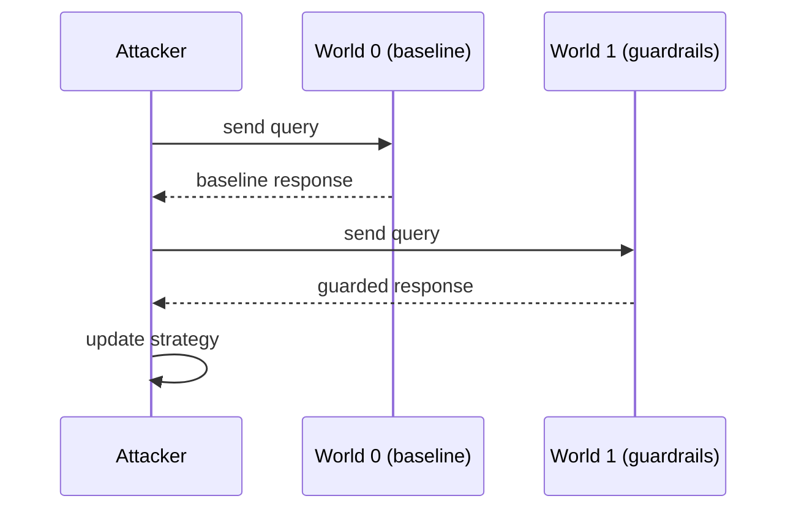
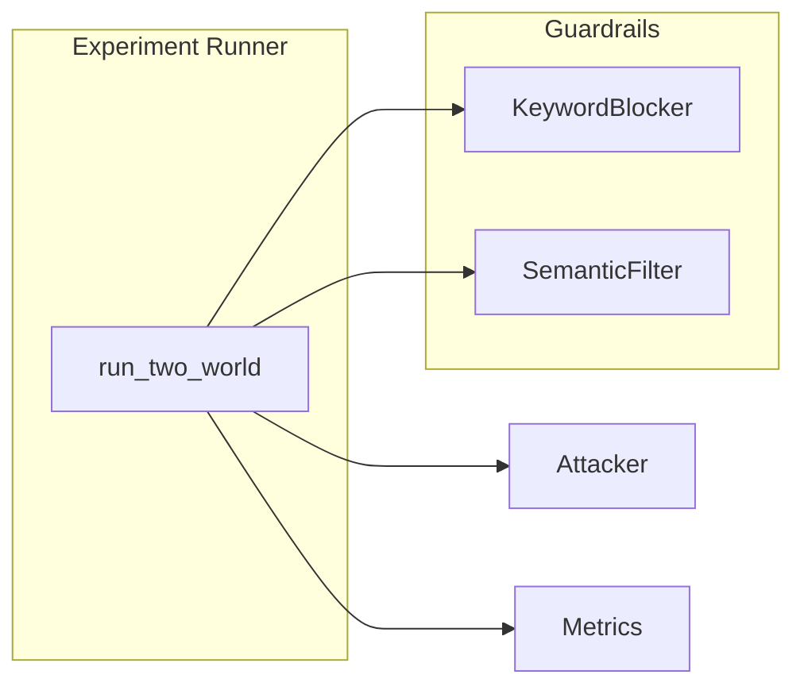

# Protocol Sequence

This document sketches the information flow and protocol used in the
cc‑framework.

## Sequence Diagram

## Module Interaction

## Protocol Notes

* Sessions alternate between baseline and composed worlds.
* The attacker receives both responses to compute distinguishing power.
* Metrics (e.g., `cc_max`) summarise attacker advantage across sessions.

For implementation details see the [Developer Manual](../index.md).

For artifact storage guarantees, see [Storage Layout](storage_layout.md).
