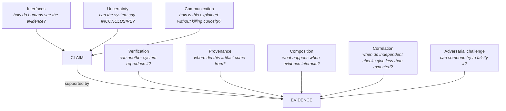

# The Research Graph

## The invariant

Reading the [inventory](inventory.md) for repeated verbs rather than repeated
nouns, the same loop appears in the kernel, in the evidence layer, in the tests,
in the film, and on the canonical page:

```text
claim
  → decompose
  → bind to artifact
  → reproduce
  → mutate
  → observe
  → bound the conclusion
  → expose the limitation
```

The `mutate` step is the one most projects skip. It is the difference between a
system that reports success and a system that can be shown to fail. Every
artifact in the inventory that feels distinctive has a mutation step somewhere:
the adversarial transparency-log test, the one-character edit on the canonical
page, the reserved-vocabulary rejection, [CH-001](challenges.md).

## Ten ways to say it

Written to be accurate rather than good.

1. Across my work, I keep trying to **make technical claims executable enough to challenge**.
2. …to **preserve the path between an assertion and the artifact underneath it**.
3. …to **stop green checks from silently expanding into larger claims**.
4. …to **design interfaces where evidence retains its boundaries**.
5. …to **make uncertainty inspectable without making it boring**.
6. …to **give a result somewhere to fail, in public, before anyone asks**.
7. …to **keep the assumptions attached to the number after it leaves the room**.
8. …to **make the width of an interval as visible as its midpoint**.
9. …to **build systems that can say INCONCLUSIVE without treating it as failure**.
10. …to **make overclaiming physically uncomfortable to do**.

Numbers 3 and 10 are the annoyingly obvious ones. Those are the keepers.

## The graph

At the centre, one edge:

```text
CLAIM ────────────► EVIDENCE
        supported by
```

Everything else is a question about how that edge can fail.



### The eight nodes

| Node | The question it holds open |
| --- | --- |
| **Verification** | Can another system, run by someone else, reproduce the observation? |
| **Provenance** | Where did this artifact come from, and what has happened to it since? |
| **Composition** | What happens when individual pieces of evidence are combined? |
| **Correlation** | When do apparently independent checks provide less evidence than their count suggests? |
| **Interfaces** | How does a human actually see the evidence, and what do they see instead of it? |
| **Uncertainty** | Can the system say INCONCLUSIVE, and does anything downstream survive it? |
| **Adversarial challenge** | Can someone deliberately attempt to falsify the result, and is that attempt welcome? |
| **Communication** | How is all of this explained without destroying the curiosity that brought someone here? |

## Where the artifacts attach

| Artifact | Nodes |
| --- | --- |
| Finite-atom LP, Fréchet bounds, endpoint witnesses | Composition, Correlation |
| Correlation cliff experiments | Correlation, Uncertainty |
| Sample complexity, outer intervals | Verification, Uncertainty |
| Role ontology, confirmatory protocol | Composition, Verification |
| Merkle log, anchoring, receipts | Provenance, Verification |
| Decay policy | Provenance, Uncertainty |
| Claim governance verdict | Composition, Interfaces |
| Deterministic capsule | Verification, Provenance |
| Adversarial transparency-log tests, CH-001 | Adversarial challenge, Verification |
| Non-claims, claim boundary manifest, language quarantine | Interfaces, Communication |
| Claim Observatory | Interfaces, Communication |
| *Before You See It* | Communication, Uncertainty, Interfaces |
| Canonical page + WebCrypto check | Verification, Interfaces, Communication |
| Source ledger, eight-week plan, prompt library | Uncertainty, Communication |
| Ghost-Ark | Provenance, Verification, Adversarial challenge |

Every node has at least two artifacts attached, and no artifact attaches to only
one. That is what makes this a program rather than a portfolio: the artifacts
were not planned against this graph, and they populate it anyway.

## The thinnest node

**Adversarial challenge** was, until this session, held up almost entirely by
one adversarial test file. [CH-001](challenges.md) was run specifically to load
it, and it produced the most useful result in the inventory. The node is still
thin. That is where the next work goes.

## Organizational separation

Intellectual connection does not require organizational merger.

It is accurate to say:

> These projects inform my thinking.

It is not accurate, and not permitted, to say:

> These are all Cubits11 products.

| Name | In the graph | In the org |
| --- | --- | --- |
| CC-Framework | Composition, Correlation, bounded evidence | Research repository |
| Ghost-Ark | Provenance, Verification, Adversarial challenge | **Separate institutional artifact.** Not a product, not a credential, not an endorsement. |
| Canonical page, film | Interfaces, Communication, Uncertainty | Cubits11 public work |

Keeping these distinct is not modesty. A shared intellectual frame that is
presented as a shared commercial entity is itself a scope inflation — the same
error described in
[evidence scope inflation](evidence-scope-inflation.md), applied to
institutions instead of hashes.

## Non-claims

- The graph is a description of existing work, not a claim that the work is
  correct, complete, or novel.
- Attaching an artifact to a node does not mean that node's question has been
  answered.
- The ten sentences are attempts at accuracy about intent. They are not findings.
